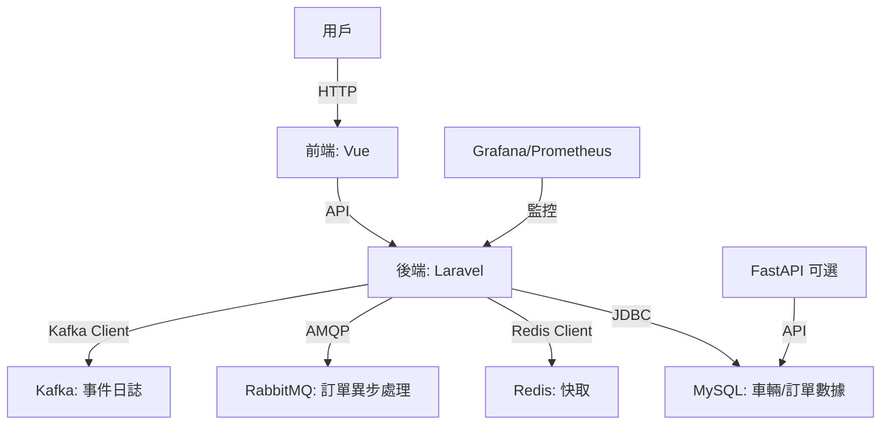

# B2B 租車平台 MVP

這是一個簡單實用的 B2B 租車平台 MVP，專為企業用戶設計，提供車輛查詢、預約與訂單管理功能。後端用 Laravel（需自行補充基本代碼），前端用 Vue，支援 Docker 容器化部署，搭配 MySQL、Redis 和 RabbitMQ，預留 FastAPI 做 AI 動態定價。程式碼聚焦核心功能，模組化設計，方便後續擴展。

## 專案亮點

- **模組化架構**：Laravel 後端與 Vue 前端分離，API 驅動，易於維護。
- **容器化部署**：Docker 整合 MySQL、Redis、RabbitMQ，環境一致，快速上線。
- **多租戶雛形**：支援 `tenant_id` 基礎結構，未來可實現資料隔離。
- **異步處理**：用 RabbitMQ 處理訂單任務，提升穩定性。
- **可擴展性**：預留 FastAPI 服務，方便加入 AI 或動態定價。

## 架構圖

系統架構如下，簡單明瞭：



- **前端**：Vue 負責頁面渲染，呼叫 Laravel API。
- **後端**：Laravel 處理業務邏輯，連 MySQL 存數據，Redis 快取熱門車輛。
- **消息隊列**：RabbitMQ 處理訂單異步任務，Kafka 記錄事件日誌。
- **監控**：Grafana 和 Prometheus 提供服務狀態監控。

## 環境需求

- Docker & Docker Compose
- PHP 8.3（Laravel 後端）
- Node.js 20.x（Vue 前端）
- Composer（PHP 依賴管理）
- npm（前端依賴管理）

## 安裝步驟

> **注意**：本倉庫僅包含核心代碼，Laravel 部分缺乏基本代碼（如 `composer.json`、模型、遷移等），需自行補充。以下步驟假設您已準備好環境並完成 Laravel 設置。

1. 複製倉庫：
   ```bash
   git clone https://github.com/BpsEason/b2b_rentcar_platform.git
   cd b2b_rentcar_platform
   ```

2. 初始化 Laravel 專案：
   ```bash
   cd laravel-app
   composer init
   composer require laravel/framework:^11.0 guzzlehttp/guzzle:^7.9 laravel/sanctum:^4.0 tymon/jwt-auth:^2.1
   php artisan install
   ```
   - 參考 Laravel 官方文件，手動創建模型（如 `Car`、`Booking`）、遷移和資料庫結構。
   - 範例遷移文件（`database/migrations/xxxx_create_cars_table.php`）：
     ```php
     Schema::create('cars', function (Blueprint $table) {
         $table->id();
         $table->string('model');
         $table->decimal('daily_rate', 8, 2);
         $table->boolean('available')->default(true);
         $table->timestamps();
     });
     ```

3. 配置環境變數：
   ```bash
   cp .env.example .env
   ```
   編輯 `.env`，填入 MySQL、Redis、RabbitMQ 連線資訊，確保 `JWT_SECRET` 為強密鑰（至少 40 字元）。

4. 啟動 Docker 服務：
   ```bash
   docker compose up --build -d
   ```
   *此步驟建置並啟動服務，可能需等待映像下載。*

5. 設置 Laravel：
   ```bash
   docker compose exec laravel-app composer install
   docker compose exec laravel-app php artisan key:generate
   docker compose exec laravel-app php artisan jwt:secret
   docker compose exec laravel-app php artisan migrate
   ```

6. 設置前端：
   ```bash
   cd frontend-app
   npm install
   npm run build
   ```

7. 訪問應用：
   - 前端：`http://localhost`
   - Laravel API：`http://localhost:8000`
   - FastAPI（若啟用）：`http://localhost:8001`
   - Grafana：`http://localhost:3000`（預設帳密：admin/admin）
   - RabbitMQ 管理介面：`http://localhost:15672`（帳密參考 `.env`）

## 核心代碼

以下展示租車功能的核心邏輯，附詳細註解，方便理解與維護。

### 後端：車輛預約 API（Laravel）

`laravel-app/app/Http/Controllers/CarRentalController.php`

```php
<?php
namespace App\Http\Controllers;

use App\Models\Car;
use App\Models\Booking;
use Illuminate\Http\Request;
use Illuminate\Support\Facades\Auth;

class CarRentalController extends Controller
{
    /**
     * 查詢可用車輛
     * @param Request $request HTTP 請求，包含可選的 start_date 和 end_date 參數
     * @return \Illuminate\Http\JsonResponse 可用車輛列表
     */
    public function index(Request $request)
    {
        // 查詢可用車輛（available = true）
        $cars = Car::query()
            ->where('available', true)
            // 若提供起訖日期，過濾已被預約的車輛
            ->when($request->start_date, function ($query) use ($request) {
                $query->whereDoesntHave('bookings', function ($q) use ($request) {
                    // 排除預約時間重疊的車輛
                    $q->whereBetween('start_date', [$request->start_date, $request->end_date])
                      ->orWhereBetween('end_date', [$request->start_date, $request->end_date]);
                });
            })
            ->get();

        // 回傳 JSON 格式的車輛列表
        return response()->json($cars);
    }

    /**
     * 處理車輛預約請求
     * @param Request $request HTTP 請求，包含 car_id、start_date、end_date
     * @return \Illuminate\Http\JsonResponse 預約結果
     */
    public function book(Request $request)
    {
        // 驗證請求參數
        $request->validate([
            'car_id' => 'required|exists:cars,id', // 車輛 ID 必填且需存在
            'start_date' => 'required|date|after:now', // 開始日期必填且需晚於當前時間
            'end_date' => 'required|date|after:start_date', // 結束日期必填且需晚於開始日期
        ]);

        // 查詢指定車輛
        $car = Car::find($request->car_id);
        // 檢查車輛是否可用
        if (!$car->available) {
            return response()->json(['error' => '車輛不可用'], 400);
        }

        // 創建預約記錄
        $booking = Booking::create([
            'user_id' => Auth::id(), // 當前認證用戶的 ID
            'car_id' => $request->car_id,
            'start_date' => $request->start_date,
            'end_date' => $request->end_date,
            'status' => 'pending', // 預約初始狀態為待確認
        ]);

        // 將預約任務發送至 RabbitMQ 進行異步處理
        dispatch(new ProcessBooking($booking));

        // 回傳成功訊息與預約詳情
        return response()->json(['message' => '預約成功，待確認', 'booking' => $booking]);
    }
}
```

- **功能**：查詢可用車輛（過濾預約時間），處理預約請求並發送至 RabbitMQ。
- **說明**：使用 Eloquent 查詢，JWT 驗證用戶，異步任務提升效能。需自行創建 `Car` 和 `Booking` 模型。

### 前端：車輛列表組件（Vue）

`frontend-app/src/components/CarList.vue`

```vue
<template>
  <div class="car-list">
    <!-- 顯示車輛列表標題 -->
    <h2>可用車輛</h2>
    <!-- 遍歷車輛數據，渲染每個車輛卡片 -->
    <div v-for="car in cars" :key="car.id" class="car-item">
      <h3>{{ car.model }}</h3>
      <p>日租金: {{ car.daily_rate }} 元</p>
      <!-- 點擊觸發預約功能 -->
      <button @click="bookCar(car.id)">預約</button>
    </div>
  </div>
</template>

<script>
import axios from 'axios';

export default {
  // 定義組件數據
  data() {
    return {
      cars: [], // 儲存從 API 獲取的車輛列表
      startDate: '', // 預約開始日期
      endDate: '', // 預約結束日期
    };
  },
  // 組件掛載時自動載入車輛數據
  mounted() {
    this.fetchCars();
  },
  methods: {
    /**
     * 從後端 API 獲取可用車輛列表
     * @returns {Promise<void>}
     */
    async fetchCars() {
      try {
        // 發送 GET 請求，包含起訖日期參數
        const response = await axios.get('/api/cars', {
          params: {
            start_date: this.startDate,
            end_date: this.endDate,
          },
        });
        // 更新車輛列表數據
        this.cars = response.data;
      } catch (error) {
        // 錯誤處理，記錄至控制台
        console.error('無法載入車輛:', error);
      }
    },
    /**
     * 提交車輛預約請求
     * @param {number} carId 車輛 ID
     * @returns {Promise<void>}
     */
    async bookCar(carId) {
      try {
        // 發送 POST 請求，提交預約資料
        const response = await axios.post('/api/bookings', {
          car_id: carId,
          start_date: this.startDate,
          end_date: this.endDate,
        });
        // 顯示預約成功訊息
        alert(response.data.message);
      } catch (error) {
        // 顯示預約失敗訊息
        alert('預約失敗: ' + error.response.data.error);
      }
    },
  },
};
</script>

<style scoped>
/* 樣式限定於本組件 */
.car-list {
  max-width: 800px;
  margin: 0 auto; /* 居中顯示 */
}
.car-item {
  border: 1px solid #ddd; /* 卡片邊框 */
  padding: 10px;
  margin-bottom: 10px; /* 卡片間距 */
}
</style>
```

- **功能**：顯示可用車輛，支援時間篩選與預約。
- **說明**：用 axios 呼叫後端 API，簡單響應式設計。

## 注意事項

- **Laravel 設置**：需手動補充 `composer.json`、模型、遷移等，參考 Laravel 官方文件。
- **安全性**：設置 `.env` 權限（`chmod 600 .env`），勿上傳至 Git。
- **多租戶**：僅包含 `tenant_id` 雛形，需自行實現隔離邏輯。
- **密碼管理**：Grafana 和 RabbitMQ 預設密碼需在生產環境更換。
- **FastAPI**：預設禁用，啟用需編輯 `docker-compose.yml`。

## 未來計劃

- 完善多租戶功能（資料庫或 Schema 隔離）。
- 加入支付模組（如 Stripe）。
- 優化查詢效能，支援大規模數據。
- 導入日誌聚合（如 Grafana Loki）。

## 問與答

以下是一些常見的技術與架構問題，以及我作為一位資深 PHP 工程師的回答，分享設計思路與實務經驗。

### 技術架構理解與動機

**問：為什麼選擇 Laravel + FastAPI，而不是純 Laravel 或純 Python？**

答：Laravel 的強項在於快速開發 API、管理後台，以及整合像 Sanctum 或 Nova 這樣的生態工具，特別適合中小型系統的業務邏輯。但對於高頻查詢或需要低延遲的場景，比如動態定價或 AI 推薦，FastAPI 搭配 Celery 的非同步處理能力更強，效能更好。這個專案用 Laravel 處理核心業務，用 FastAPI 預留擴展空間，兩者各司其職，保持模組清晰又能互補。

**問：為什麼用 RabbitMQ，而不是 Laravel 原生的 queue driver？**

答：Laravel 的 queue driver 很方便，但 RabbitMQ 提供了更強的訊息持久化與路由功能，適合跨服務的異步任務，比如訂單通知或車況更新。RabbitMQ 也能讓 FastAPI 或其他微服務消費訊息，增加架構彈性。未來若需要高可用性，RabbitMQ 的叢集化也比 Laravel queue 更容易實現。

**問：Kafka 在這個架構中的實際用途是什麼？**

答：Kafka 用來統一管理平台內的事件日誌，例如新訂單成立、車輛狀態變更等。這些事件會觸發 FastAPI 重新計算推薦結果或失效 Redis 快取。Kafka 的高吞吐量和分區設計，讓我們能輕鬆擴展消費者，未來也能用來串接外部系統，比如財務或 ERP，確保資料一致性。

### 安全性與維運策略

**問：JWT 如何實現 token 失效與更新？**

答：我用 `tymon/jwt-auth` 套件，設定 token 的有效期限（TTL），並支援 refresh token 機制。失效 token 會記錄在黑名單（用 Redis 儲存），避免重複使用。未來可以加入 token rotation，定期輪換 token 提升安全性。每次刷新 token 時，會驗證用戶權限，確保無異常操作。

**問：Redis 快取有考慮 expiration 機制與資料一致性嗎？**

答：有的。Redis 快取的 TTL 根據資料更新頻率設定，比如熱門車輛資訊設 5 分鐘過期，減少資料庫壓力。為了確保一致性，我用 Kafka 監聽車輛或訂單變更事件，觸發快取失效。這樣既能兼顧效能，也能避免快取與資料庫不同步。

**問：如果租車價格調整導致 booking 價格錯誤，怎麼設計 rollback？**

答：訂單成立時，我會把當下的價格快照（snapshot）寫進 `bookings` 表，確保每筆訂單的價格獨立不受後續調整影響。如果需要 rollback，比如訂單取消，我會記錄操作日誌（用 Laravel 的 event 系統），並透過事務（transaction）確保資料庫變更原子性，必要時也能手動還原。

### 模組劃分與可擴展性

**問：若支援長期租賃或企業方案，這架構還適用嗎？**

答：這架構從一開始就考慮模組化，`Booking` 和 `RentalRate` 模型支援週期性計價和客製規則，企業方案可以透過 `tenant_id` 隔離資料。未來若需要更複雜的計價邏輯，可以用 FastAPI 處理演算法部分，Laravel 負責業務整合，架構彈性夠大。

**問：若用戶量倍增，怎麼 scale FastAPI？**

答：FastAPI 部署在 Docker 容器中，支援水平擴展。我會用 Kubernetes 或 ECS 做 auto-scaling，根據 CPU 或請求量動態增加實例。同時，Redis 和 MySQL 可以分離讀寫，Kafka 也能加分區提升吞吐量，確保系統穩定應對流量成長。

**問：這架構能替代傳統 ERP 或串接第三方系統嗎？**

答：這套架構適合 B2B 租車業務的核心功能，短期內可以取代 ERP 的訂單和車輛管理模組。透過 Kafka 的 event-driven 設計，能輕鬆串接第三方系統，比如財務結帳或倉儲管理。Laravel Nova 也支援客製化後台，方便不同租戶配置專屬邏輯。

### 團隊合作與技術角色定位

**問：這架構是你主導設計的嗎？**

答：是的，這是我主導規劃的架構，目的是讓各模組職責分明，方便團隊分工。Laravel 負責業務核心，前端和 FastAPI 則獨立開發，降低耦合。我也會透過 ERD 和 API 文件，確保團隊對架構有共識。

**問：如果 junior 工程師不熟悉這些技術，怎麼 onboarding？**

答：我會先讓 junior 從 Laravel 的 Service 層或前端 API 呼叫開始，這些部分邏輯簡單，容易上手。提供 ERD 和系統流程圖，搭配 Docker 環境讓他們快速跑起來。透過 PR 審查和一對一討論，逐步引導他們理解 RabbitMQ 或 Kafka 的用途，幫助他們成長。

## 問題反饋

有問題或建議，請開 issue，會盡快回應。謝謝！
