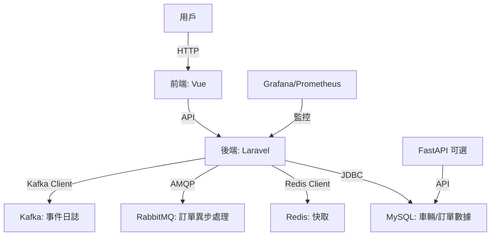

# B2B 租車平台 MVP

這是一個簡單實用的 B2B 租車平台 MVP，專為企業用戶設計，提供車輛查詢、預約與訂單管理功能。後端用 Laravel，前端用 Vue，支援 Docker 容器化部署，搭配 MySQL、Redis 和 RabbitMQ，預留 FastAPI 做 AI 動態定價。程式碼聚焦核心功能，模組化設計，方便後續擴展。

## 專案亮點

- **模組化架構**：Laravel 後端與 Vue 前端分離，API 驅動，易於維護與升級。
- **容器化部署**：Docker 整合 MySQL、Redis、RabbitMQ 等服務，環境一致，快速上線。
- **多租戶雛形**：支援 `tenant_id` 基礎結構，未來可實現資料隔離。
- **異步處理**：用 RabbitMQ 處理訂單任務，提升系統穩定性。
- **可擴展性**：預留 FastAPI 服務，方便加入 AI 推薦或動態定價。

## 架構圖

系統架構如下，簡單明瞭：



- **前端**：Vue 負責頁面渲染，呼叫 Laravel API。
- **後端**：Laravel 處理業務邏輯，連 MySQL 存數據，Redis 快取熱門車輛。
- **消息隊列**：RabbitMQ 處理訂單異步任務，Kafka 記錄事件日誌。
- **監控**：Grafana 和 Prometheus 提供服務狀態監控。

## 環境需求

- Docker & Docker Compose
- PHP 8.3（Laravel 後端）
- Node.js 20.x（Vue 前端）
- Composer（PHP 依賴管理）
- npm（前端依賴管理）

## 安裝步驟

> **注意**：本倉庫僅包含核心代碼，需自行補充依賴與配置（如 `.env`、Dockerfile）。以下步驟假設您已準備好環境。

1. 複製倉庫：
   ```bash
   git clone https://github.com/BpsEason/b2b_rentcar_platform.git
   cd b2b_rentcar_platform
   ```

2. 配置環境變數：
   ```bash
   cp .env.example .env
   ```
   編輯 `.env`，填入 MySQL、Redis、RabbitMQ 等連線資訊，確保 `JWT_SECRET` 為強密鑰（至少 40 字元）。

3. 啟動 Docker 服務：
   ```bash
   docker compose up --build -d
   ```
   *此步驟建置並啟動所有服務，可能需等待映像下載完成。*

4. 設置 Laravel：
   ```bash
   docker compose exec laravel-app composer install
   docker compose exec laravel-app php artisan key:generate
   docker compose exec laravel-app php artisan jwt:secret
   docker compose exec laravel-app php artisan migrate
   ```

5. 設置前端：
   ```bash
   cd frontend-app
   npm install
   npm run build
   ```

6. 訪問應用：
   - 前端：`http://localhost`
   - Laravel API：`http://localhost:8000`
   - FastAPI（若啟用）：`http://localhost:8001`
   - Grafana：`http://localhost:3000`（預設帳密：admin/admin）
   - RabbitMQ 管理介面：`http://localhost:15672`（帳密參考 `.env`）

## 核心代碼

以下展示租車功能的核心邏輯，保持簡潔實用。

### 後端：車輛預約 API（Laravel）

`laravel-app/app/Http/Controllers/CarRentalController.php`

```php
<?php
namespace App\Http\Controllers;

use App\Models\Car;
use App\Models\Booking;
use Illuminate\Http\Request;
use Illuminate\Support\Facades\Auth;

class CarRentalController extends Controller
{
    public function index(Request $request)
    {
        $cars = Car::query()
            ->where('available', true)
            ->when($request->start_date, function ($query) use ($request) {
                $query->whereDoesntHave('bookings', function ($q) use ($request) {
                    $q->whereBetween('start_date', [$request->start_date, $request->end_date])
                      ->orWhereBetween('end_date', [$request->start_date, $request->end_date]);
                });
            })
            ->get();

        return response()->json($cars);
    }

    public function book(Request $request)
    {
        $request->validate([
            'car_id' => 'required|exists:cars,id',
            'start_date' => 'required|date|after:now',
            'end_date' => 'required|date|after:start_date',
        ]);

        $car = Car::find($request->car_id);
        if (!$car->available) {
            return response()->json(['error' => '車輛不可用'], 400);
        }

        $booking = Booking::create([
            'user_id' => Auth::id(),
            'car_id' => $request->car_id,
            'start_date' => $request->start_date,
            'end_date' => $request->end_date,
            'status' => 'pending',
        ]);

        dispatch(new ProcessBooking($booking));

        return response()->json(['message' => '預約成功，待確認', 'booking' => $booking]);
    }
}
```

- **功能**：查詢可用車輛（過濾預約時間），處理預約請求並發送至 RabbitMQ。
- **說明**：使用 Eloquent 查詢，JWT 驗證用戶，異步任務提升效能。

### 前端：車輛列表組件（Vue）

`frontend-app/src/components/CarList.vue`

```vue
<template>
  <div class="car-list">
    <h2>可用車輛</h2>
    <div v-for="car in cars" :key="car.id" class="car-item">
      <h3>{{ car.model }}</h3>
      <p>日租金: {{ car.daily_rate }} 元</p>
      <button @click="bookCar(car.id)">預約</button>
    </div>
  </div>
</template>

<script>
import axios from 'axios';

export default {
  data() {
    return {
      cars: [],
      startDate: '',
      endDate: '',
    };
  },
  mounted() {
    this.fetchCars();
  },
  methods: {
    async fetchCars() {
      try {
        const response = await axios.get('/api/cars', {
          params: {
            start_date: this.startDate,
            end_date: this.endDate,
          },
        });
        this.cars = response.data;
      } catch (error) {
        console.error('無法載入車輛:', error);
      }
    },
    async bookCar(carId) {
      try {
        const response = await axios.post('/api/bookings', {
          car_id: carId,
          start_date: this.startDate,
          end_date: this.endDate,
        });
        alert(response.data.message);
      } catch (error) {
        alert('預約失敗: ' + error.response.data.error);
      }
    },
  },
};
</script>

<style scoped>
.car-list {
  max-width: 800px;
  margin: 0 auto;
}
.car-item {
  border: 1px solid #ddd;
  padding: 10px;
  margin-bottom: 10px;
}
</style>
```

- **功能**：顯示可用車輛，支援時間篩選與預約。
- **說明**：用 axios 呼叫後端 API，簡單響應式設計。

## 注意事項

- **安全性**：請設置 `.env` 權限（`chmod 600 .env`），勿上傳至 Git。
- **多租戶**：僅包含 `tenant_id` 雛形，需自行實現完整隔離邏輯。
- **密碼管理**：Grafana 和 RabbitMQ 預設密碼需在生產環境更換。
- **FastAPI**：預設禁用，啟用需編輯 `docker-compose.yml`。

## 未來計劃

- 完善多租戶功能（資料庫或 Schema 隔離）。
- 加入支付模組（如 Stripe）。
- 優化車輛查詢效能，支援大規模數據。
- 導入日誌聚合（如 Grafana Loki）與 CI/CD。

## 問題反饋

有問題或建議，請開 issue，會盡快回應。謝謝！
